<div align="center">
  
  <p><strong>A curated gallery of AI prompts that actually work, with one-click copy and filtering.</strong></p>
  <p>
    <a href="https://prmpt-hstry.vercel.app"><strong>🚀 Live Demo</strong></a>
  </p>
</div>

# prompt.gallery

**A curated collection of AI prompts that actually work.** Browse proven prompts across coding, writing, analysis, and creative categories with one-click copy functionality. Think [reallygoodemails.com](https://reallygoodemails.com) but for AI prompts - no fluff, just prompts that deliver results tied to real finished products so you can learn what actually works.

## What it does

- **One-click copy** — Click any prompt card to instantly copy it to your clipboard
- **Smart filtering** — Browse by category: Coding, Writing, Analysis, Creative, System prompts
- **Keyboard shortcuts** — `Cmd/Ctrl + 1-9` to quickly copy the nth visible prompt
- **Clean interface** — Dark UI optimized for daily AI users, with monospace formatting for prompts
- **No BS** — Every prompt is tied to actual results, not theoretical examples

## Quick Start

The gallery runs as a static site - no installation needed:

```bash
# Clone and serve locally
git clone https://github.com/yourusername/prmpt-hstry.git
cd prmpt-hstry
python3 -m http.server 8080

# Open http://localhost:8080
```

Or just visit the live version at [prompt.gallery](https://prompt.gallery) (if deployed).

## Usage

1. **Browse prompts** by category or scroll through all
2. **Click any card** to copy the prompt instantly  
3. **Use keyboard shortcuts** `Cmd/Ctrl + 1-9` for rapid copying
4. **Filter by clicking** category tags to focus on specific types

## Adding Your Own Prompts

Edit `index.html` and add a new prompt card:

```html
<article class="prompt-card" data-category="coding">
  <div class="prompt-content">
    <p>Your prompt text here...</p>
  </div>
  <div class="prompt-meta">
    <span class="category">coding</span>
    <span class="description">Brief description of what this does</span>
  </div>
</article>
```

Available categories: `coding`, `writing`, `analysis`, `creative`, `system`

## Architecture

```mermaid
flowchart LR
    subgraph Static["📄 Static Files"]
        HTML[index.html]
        CSS[styles.css]
        JS[script.js]
    end
    
    subgraph UX["✨ User Flow"]
        Browse[Browse]
        Filter[Filter]
        Copy[One-Click Copy]
    end
    
    HTML --> Browse
    CSS --> Browse
    JS --> Filter
    JS --> Copy
    
    style Static fill:#0c0a09,stroke:#78716c,color:#fff
    style UX fill:#0c0a09,stroke:#fcd34d,color:#fff
```



## Tech Stack

- **Pure HTML/CSS/JS** — No build step, no dependencies, just works
- **IBM Plex Mono** for prompt text (optimal readability)
- **Instrument Sans** for UI elements
- **Static hosting ready** — Deploy anywhere

## Why This Exists

Most prompt collections are either theoretical examples or buried in long blog posts. This gallery focuses on prompts that are:

- **Battle-tested** — Used in real projects with real results
- **Immediately usable** — Copy and paste, no modification needed  
- **Properly categorized** — Find what you need quickly
- **Accessible** — Works offline, loads fast, no tracking

Built for people who use AI tools daily and need reliable prompts that actually work.